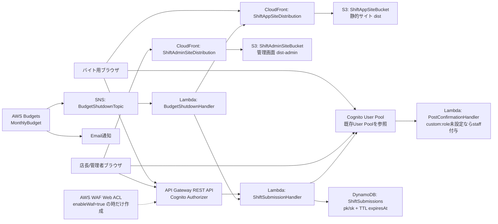

# シフト提出アプリ 仕様まとめ

## 目的
- Webからバイトがシフト提出できる
- 店長が割当・公開し、バイトが閲覧できる
- SOAの考え方で拡張・仕様変更に強い構成

## 対象ユーザー
- 店長
- バイト

## 確定仕様
- シフト提出の粒度: 30分
- 提出形式: 入れる時間を提出
- ロール: 追加可能（バイトは複数ロールを持てる）
- 自動割当: 将来拡張（現時点は手動のみ）
- 1日あたりの最大勤務時間制限: なし
- 提出修正: 公開前のみ可能
- 公開フロー: 店長レビューのみで公開、公開後は変更不可
- 対象期間: 1ヶ月ごとに運用
- 店舗: 1店舗

## 画面（主要）
- ログイン
- バイト: シフト提出（カレンダー/クリック・ドラッグ）
- 店長: シフト作成（手動割当）
- シフト一覧（公開後閲覧）

## 操作フロー
- バイト: ログイン -> 月選択 -> 提出 -> 公開前は修正可
- 店長: ログイン -> 提出一覧 -> 割当 -> 公開
- バイト: 公開後に閲覧

## 画面ワイヤー（ラフ）

### ログイン
```
+------------------------------------------------------+
| [App Name]                                            |
|                                                      |
|  Email                                                |
|  [______________________________]                    |
|                                                      |
|  Password                                             |
|  [______________________________]                    |
|                                                      |
|  [ Login ]                                            |
|                                                      |
|  [ Forgot Password ]                                 |
+------------------------------------------------------+
```

### バイト: シフト提出（カレンダー/クリック・ドラッグ）
```
+------------------------------------------------------+
| [Month Picker]  2026-06          [ Submit ]           |
| Status: Draft (Editable)                              |
|                                                      |
|  Su Mo Tu We Th Fr Sa                                 |
|  [  ] [  ] [  ] [  ] [  ] [  ] [  ]                   |
|  [  ] [  ] [  ] [  ] [  ] [  ] [  ]                   |
|                                                      |
|  Time Grid (30min)                                    |
|  09:00 |[][][][][]                                    |
|  09:30 |[][][][][]                                    |
|  10:00 |[][][][][]                                    |
|  ...                                                  |
|  Drag to select available slots                       |
+------------------------------------------------------+
```

### 店長: シフト作成（手動割当）
```
+------------------------------------------------------+
| [Month Picker]  2026-06     [ Publish ]               |
| Status: Draft                                        |
|                                                      |
|  Left: Availability List                              |
|  - Alice (hall, kitchen)                              |
|  - Bob (hall)                                         |
|  - Carol (kitchen)                                    |
|                                                      |
|  Right: Assignment Grid (30min)                       |
|  09:00 | [role] [user]                                |
|  09:30 | [role] [user]                                |
|  10:00 | [role] [user]                                |
|  ...                                                  |
|                                                      |
|  [ Add Role ] [ Add User ]                            |
+------------------------------------------------------+
```

### シフト一覧（公開後閲覧）
```
+------------------------------------------------------+
| [Month Picker]  2026-06                               |
| Status: Published                                     |
|                                                      |
|  Date       Time       Role      User                |
|  06/01      09:00-12:00 hall      Alice               |
|  06/01      12:00-15:00 kitchen   Carol               |
|  ...                                                 |
+------------------------------------------------------+
```

## 画面ワイヤー詳細（状態/操作）

### ログイン
- 状態: 未ログイン
- 操作: Email/Password入力 -> Login
- エラー: 認証失敗、未入力
- 遷移: ログイン成功でロール別ホームへ

### バイト: シフト提出
- 状態: Draft (公開前) / Locked (公開後)
- 操作: 月選択、カレンダー日付選択、時間グリッドのドラッグ選択
- 変更: Draftのみ編集可、公開後は編集不可
- 保存: Submitで保存、保存成功/失敗の通知
- エラー: 公開後の編集、無効な時間帯

### 店長: シフト作成
- 状態: Draft / Published
- 操作: 月選択、提出一覧の確認、割当グリッドでrole+user指定
- 機能: 役割追加、ユーザー追加（roleフィルタ）
- 保存: 割当変更は自動保存、Publishで確定
- エラー: 未割当の必須枠、公開後の変更

### シフト一覧
- 状態: Publishedのみ表示
- 操作: 月選択、一覧閲覧
- 表示: 日付/時間/role/user

## 画面遷移図（簡易）
```
[Login]
  | success
  v
[Role Home]
  |--(staff)--> [Shift Submit]
  |--(manager)-> [Shift Create]
  v
[Shift List]
```

## サービス分割（論理SOA）
- User Service: ユーザー/ロール管理
- Availability Service: 希望提出
- Scheduling Service: 店長の手動割当（自動割当は将来拡張）
- Publishing Service: 公開状態管理
- Notification Service: 公開通知やリマインド（将来拡張）

## AWS構成（CDK実装ベース）

### 全体構成図


### フロントエンド
- バイト向け画面は `dist` を S3 にデプロイし、CloudFront から配信する。
- 管理画面は `dist-admin` を別 S3 にデプロイし、別 CloudFront から配信する。
- S3 バケットは公開せず、CloudFront の Origin Access Identity 経由で読み取る。
- SPA 対応として CloudFront の 403/404 は `/index.html` に返す。

### 認証・認可
- Cognito User Pool は CDK の `userPoolId` context で既存プールを参照する。
- API Gateway は Cognito User Pools Authorizer で保護する。
- 管理者判定は Cognito group の `admins`（contextで変更可）を使う。
- `PostConfirmationHandler` が Cognito の Post Confirmation トリガーとして設定され、`custom:role` が未設定のユーザーに `staff` を付与する。
- Cognito の標準機能により、パスワード認証の失敗が累積するとユーザー単位で一時ロックアウトされる。5回失敗後からロックアウトが始まり、追加失敗ごとに待機時間が伸び、最大約15分になる。

### API・業務ロジック
- API Gateway REST API が `/availability`, `/assignments`, `/publish`, `/admin/*` を公開する。
- すべての主要 API は `ShiftSubmissionHandler` Lambda に統合される。
- CORS はバイト向け CloudFront URL と管理画面 CloudFront URL を許可する。
- API Gateway の stage には throttling rate/burst を設定する。

### データストア
- DynamoDB は単一テーブル `ShiftSubmissions` を使う。
- Partition Key は `pk`、Sort Key は `sk`。
- 月単位データを `pk = YYYY-MM` に集約し、`sk` で `SUBMISSION#...`, `ASSIGNMENT#...`, `PUBLISH` を分ける。
- TTL 属性は `expiresAt`。現在の Lambda 実装では 12ヶ月後の期限を設定する。
- Billing Mode は Pay per request。

### セキュリティ・保護
- AWS WAF は現在無効。必要になった場合は `enableWaf=true` で API Gateway stage に Regional Web ACL を再作成できる。
- WAF を有効化した場合は AWS Managed Common Rule Set と IP ベース RateLimit を設定する。
- WAF 無効時の主な保護は Cognito 認証、Cognito の失敗ロック、管理者グループ制限、API Gateway throttling、Budget 通知で行う。
- S3 は Block Public Access、SSL 強制。
- Lambda には必要な DynamoDB/Cognito/CloudFront/Lambda 権限を IAM Policy で付与する。

### コスト監視・停止
- AWS Budgets で月次コスト予算を作成する。
- 予算しきい値を超えるとメール通知と SNS 通知を行う。
- SNS 通知を受けた `BudgetShutdownHandler` が CloudFront distribution を無効化する。
- `stopApiLambda=true` の場合、API Lambda の reserved concurrency を 0 にして API 実行も止める。

### デプロイ context
- `userPoolId`: 必須。既存 Cognito User Pool ID。
- `budgetAlertEmail`: 必須。予算通知先メール。
- `allowedOrigin`: 任意。バイト向け画面の CORS origin。
- `adminAllowedOrigin`: 任意。管理画面の CORS origin。
- `adminGroupName`: 任意。既定は `admins`。
- `budgetLimitUsd`: 任意。既定は `1`。
- `budgetAlertThresholdUsd`: 任意。既定は `0.01`。
- `stopApiLambda`: 任意。既定は `true`。
- `enableWaf`: 任意。既定は `false`。`true` にすると AWS WAF を作成・関連付けする。
- `wafRateLimit`: 任意。既定は `1000`。`enableWaf=true` の時に使用する。
- `apiThrottleRate`: 任意。既定は `20`。
- `apiThrottleBurst`: 任意。既定は `40`。

### 注意事項
- `budgetShutdownThresholdUsd` は context として定義されているが、現在の CDK 実装では Budget notification のしきい値に使われていない。
- CDK の removal policy は主要リソースで `DESTROY` が使われているため、本番運用では保持ポリシーの見直しが必要。

## データ設計（シンプル案）
- users
  - PK: userId
  - name, roles[], status
- roles
  - PK: roleId
  - name, active
- availability
  - PK: month#userId
  - month, userId, slots[] (30分単位)
- assignments
  - PK: month#slot
  - month, slot, roleId, userId
- publish_state
  - PK: month
  - status: draft | published
  - publishedAt

## API設計（最小）
- POST /availability (公開前のみ更新可)
- GET /availability?month= (店長用)
- POST /assignments (店長のみ)
- GET /assignments?month= (公開後は全員可)
- POST /publish (公開確定 -> 編集ロック)
- GET /publish?month=
